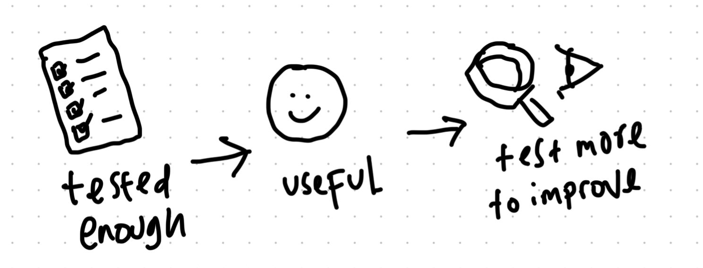

During my time in Farmacare, it's always been a huge question looming among us on when is enough. These new learnings essentially helps me understand what is considered enough and what technique can we use to prove that.

This post aims to answer that question.

- [The seven principles of testing](#the-seven-principles-of-testing)
- [The technique](#the-technique)
  - [Pairwise](#pairwise)
    - [How to do this](#how-to-do-this)
  - [Equivalence paritioning](#equivalence-paritioning)
    - [How to do it](#how-to-do-it)
  - [Boundary Value Analysis](#boundary-value-analysis)
    - [How to do it](#how-to-do-it-1)
- [Concluding thoughts](#concluding-thoughts)

## The seven principles of testing

First of all, there is this thing called the seven principles of testing which will be the basic understanding on what is enough.

The seven principles are not as easy to understand without the definition, so here's my version to make it simpler to understand---I suggest reading the meaning from top to bottom:

| Principle | Meaning |
|---|---|
| **Testing is context-dependent** | As no software is created with context, tests must also be created *with context* so there is no one single boiler-plate to testing. |
| **Exhaustive testing is not possible** | It is very expensive to test every single possible thing so you need to test *just enough*. |
| **Defect clustering** | Most issues comes from a *small part* of the system, so you don't really need to an exhaustive test. |
| **Testing shows the presence of defects** | Because it is costly to test everything, testing is a mechanism *to show* the presence of defect and *NOT* a means *to prove* that a software is free of any defect. |
| **Early testing** | It is better to detect defect *early* as it's less costly for developer to fix the defect. |
| **Pesticide paradox** | The same set of repetitive tests are conducted will not uncover new defects so test cases need to be *regularly* reviewed & revised to help find more defects. |
| **Absence of errors fallacy** | Despite all the test, a defect-free software is still an unusable software if it does *NOT follow* the user's requirements. |

That being said, now my criteria on what is enough is essentially as such:

- Tests are made with the software's context in mind:
  - the environment (such as viewport, OS, hardware, etc.)
  - the user (such as tech-saviness, while multi-tasking, low internet connection, etc.)
- There is no other meaningful test that can be run, in other words, redundancy-free
- The software is usable by the user

## The technique

There are 3 new technique I learned:

- Pairwise
- Equivalence paritioning
- Boundary test

### Pairwise

This is a technique to manage combinatorial permutation of co-depending variables to test. It significantly reduces the amount of test needed simply by making sure a pair of each test are only tested once whenever possible.

For example:

```
Format method: quick, slow
File system:   FAT, FAT32, NTFS
Compression:   on, off
```

Instead of doing all 12 combinations to test …

1. `quick + FAT   + on`
1. `quick + FAT   + off`
1. `quick + FAT32 + on`
1. `quick + FAT32 + off`
1. `quick + NTFS  + on`
1. `quick + NTFS  + off`
1. `slow  + FAT   + on`
1. `slow  + FAT   + off`
1. `slow  + FAT32 + on`
1. `slow  + FAT32 + off`
1. `slow  + NTFS  + on`
1. `slow  + NTFS  + off`

… the technique allows us to only do 6 test with high degree of confidence since all variables' values are paired at least once with another variable's value. That is 50% decrease.

1. `quick + FAT   + on`
2. `quick + FAT32 + off`
3. `slow  + FAT   + off`
4. `slow  + FAT32 + on`
5. `quick + NTFS  + on`
6. `slow  + NTFS  + off`

A bigger set of combination will result in a bigger efficiency. For example, the combination below has 4,704 combinations, only 62 are needed when using the pairwise technique. That is a whopping 98.6% decrease!

```
Type:          Primary, Logical, Single, Span, Stripe, Mirror, RAID-5
Size:          10, 100, 500, 1000, 5000, 10000, 40000
Format method: quick, slow
File system:   FAT, FAT32, NTFS
Cluster size:  512, 1024, 2048, 4096, 8192, 16384, 32768, 65536
Compression:   on, off
```

1. `Primary + 10    + slow + FAT32 + 16384 + on`
2. `Primary + 100   + quick + FAT + 2048 + off`
3. `Primary + 100   + quick + NTFS + 512 + off`
4. `Primary + 500   + quick + FAT + 65536 + off`
5. `Primary + 500   + slow + FAT32 + 4096 + off`
6. `Primary + 1000  + slow + FAT + 1024 + on`
7. `Primary + 5000  + quick + NTFS + 1024 + off`
8. `Primary + 10000 + slow + FAT + 32768 + on`
9. `Primary + 40000 + slow + FAT + 8192 + on`
10. `Primary + 40000 + quick + NTFS + 32768 + on`
11. `Logical + 500   + quick + NTFS + 8192 + off`
12. `Logical + 10000 + slow + NTFS + 512 + off`
13. `Logical + 40000 + quick + FAT32 + 16384 + off`
14. `Logical + 10    + quick + FAT + 2048 + on`
15. `Logical + 100   + quick + NTFS + 32768 + off`
16. `Logical + 1000  + slow + FAT + 4096 + off`
17. `Logical + 10000 + slow + NTFS + 1024 + off`
18. `Logical + 5000  + slow + NTFS + 65536 + off`
19. `Logical + 10000 + quick + FAT + 4096 + off`
20. `Single  + 10    + quick + FAT + 512 + off`
21. `Single  + 10000 + quick + FAT32 + 65536 + off`
22. `Single  + 100   + quick + FAT + 8192 + on`
23. `Single  + 5000  + quick + NTFS + 16384 + off`
24. `Single  + 10    + quick + NTFS + 4096 + on`
25. `Single  + 1000  + slow + FAT32 + 2048 + off`
26. `Single  + 40000 + quick + FAT + 1024 + off`
27. `Single  + 500   + quick + FAT32 + 512 + off`
28. `Single  + 5000  + quick + FAT + 32768 + on`
29. `Span    + 5000  + slow + FAT32 + 2048 + on`
30. `Span    + 10000 + slow + FAT + 16384 + on`
31. `Span    + 1000  + quick + NTFS + 512 + on`
32. `Span    + 10    + slow + FAT32 + 32768 + off`
33. `Span    + 500   + slow + FAT + 1024 + off`
34. `Span    + 40000 + quick + FAT + 4096 + on`
35. `Span    + 100   + quick + FAT + 65536 + on`
36. `Span    + 1000  + quick + NTFS + 65536 + off`
37. `Span    + 5000  + slow + FAT + 8192 + off`
38. `Stripe  + 100   + quick + FAT32 + 1024 + on`
39. `Stripe  + 5000  + slow + NTFS + 32768 + on`
40. `Stripe  + 5000  + quick + FAT + 4096 + off`
41. `Stripe  + 500   + quick + NTFS + 16384 + on`
42. `Stripe  + 10000 + quick + FAT32 + 512 + off`
43. `Stripe  + 40000 + quick + FAT32 + 65536 + on`
44. `Stripe  + 1000  + quick + FAT + 8192 + off`
45. `Stripe  + 10    + quick + NTFS + 2048 + off`
46. `Mirror  + 1000  + quick + FAT + 32768 + off`
47. `Mirror  + 100   + slow + NTFS + 65536 + on`
48. `Mirror  + 10    + quick + FAT32 + 8192 + off`
49. `Mirror  + 500   + quick + FAT32 + 2048 + on`
50. `Mirror  + 5000  + quick + FAT + 512 + on`
51. `Mirror  + 10000 + slow + FAT + 2048 + off`
52. `Mirror  + 40000 + slow + FAT32 + 4096 + off`
53. `Mirror  + 10    + slow + FAT32 + 1024 + off`
54. `Mirror  + 100   + slow + FAT32 + 16384 + off`
55. `RAID-5  + 500   + slow + FAT + 32768 + on`
56. `RAID-5 + 100   + slow + FAT32 + 4096 + off`
57. `RAID-5 + 40000 + quick + NTFS + 2048 + on`
58. `RAID-5 + 5000  + quick + NTFS + 1024 + on`
59. `RAID-5 + 10000 + slow + NTFS + 8192 + on`
60. `RAID-5 + 1000  + quick + FAT + 16384 + on`
61. `RAID-5 + 10    + slow + FAT32 + 65536 + off`
62. `RAID-5 + 40000 + quick + FAT32 + 512 + on`

#### How to do this

Let's use the 

```
Format method: quick, slow
File system:   FAT, FAT32, NTFS
Compression:   on, off
```

1. You make pair for each variable, making sure all pair combinations are made.
  - `quick + FAT`
  - `quick + FAT32`
  - `quick + NTFS`
  - `quick + on`
  - `quick + off`
  - `slow + FAT`
  - `slow + FAT32`
  - `slow + NTFS`
  - `slow + on`
  - `slow + off`
  - `FAT + on`
  - `FAT + off`
  - `FAT32 + on`
  - `FAT32 + off`
  - `NTFS + on`
  - `NTFS + off`
2. Arrange a combination of all 3 sequence using all available pairs
  - `quick + FAT + on` --> `quick + FAT` & `FAT + on` & `quick + on`
  - `quick + FAT32 + off` --->  `quick + FAT32` & `FAT32 + off` & `quick + off`
  - `slow + FAT + off` -->  `slow + FAT` & `FAT + off` & `slow + off`
  - `slow + FAT32 + on` -->  `slow + FAT32` & `FAT32 + on` & `slow + on`
  - `quick + NTFS + on` -->  `quick + NTFS` & `NTFS + on` & redundancy of `quick + on`
  - `slow + NTFS + off` -->  `slow + NTFS` & `NTFS + off` & redundancy of `slow + off`
3. As you can see, the last two on the list has a repeat combination of `quick + on` and `slow + off`, but since this is inevitable, this is a necessary redundancy.

A simpler way is to use a generator. One that I found incredibly easy to use is [Pairwise Independent Combinatorial Testing (PICT) tool](https://github.com/microsoft/pict) which is a FOSS made by Microsoft.

### Equivalence paritioning

This technique split conditional statements to multiple valids and invalid partition then make a test case from the value in each partitions. It ensures that each condition is tested at least once.

For example:

> Customer will get:
> 
> - 5% discount for $1--10 purchase
> - 10% discount for $11--100 purchase
> - 15% discount for above
>
> Minimum purchase is $1 and maximum is $500

Instead of testing sporadically and without knowing if the condition is tested enough …

- $6 should get 5% discount
- $10 should get 5% discount
- $13 should get 10% discount
- $34 should get 10% discount
- $88 should get 10% discount
- $120 should get 15% discount
- $400 should get 15% discount

… the technique allows clarity in defining "enough" by demanding exactly 5 tests to ensure all conditions are tested:

- $0.5 should result in invalid
- $6 should get 5% discount
- $34 should get 10% discount
- $400 should get 15% discount
- $700 should result in invalid

#### How to do it

Let's use the sample above:

> Valid input is only letters and not symbols nor numbers

1. Turn the conditional statement into valid and invalid partitions.

   | | invalid | valid | invalid |
   |---|---|---|---|
   | type | symbols | letters | numbers |
   | range | ~!@#?/… | A to z | 0 to 9 |

2. Take a value from each partition as test case

   - '$' should result in invalid
   - 'F' should get 5% discount
   - '4' should result in invalid

That's it!

### Boundary Value Analysis

Most often, the defect of a value range conditional statement is on the edges rather than the middle value. By checking it, we can be sure that the conditional is set properly.

This technique also allows us to limit what is enough by focusing on the point where it's most-likely fail.

For Example:

> Customer will get:
> 
> - 5% discount for $1--10 purchase
> - 10% discount for $11--100 purchase
> - 15% discount for above

Which resulted in these 6 test cases:

- $0 should no discount
- $1 should get 5% discount
- $10 should get 5% discount
- $11 should get 10% discount
- $100 should get 10% discount
- $101 should get 15% discount

#### How to do it

Let's use the sample above:

> Valid input is only letters and not symbols nor numbers

1. Turn the conditional statement into valid and invalid partitions.

   | discount | 0% | 5% | 10% | 15% |
   |---|---|---|---|---|
   | range | < $1 | $1--10 | $11--100 | > $101

2. Take a the value on the edge of each partition

   - $0 should no discount
   - $1 should get 5% discount
   - $10 should get 5% discount
   - $11 should get 10% discount
   - $100 should get 10% discount
   - $101 should get 15% discount

## Concluding thoughts

Here are the key take aways from the above.

- [No software can be defect-free as it is not viable](#the-seven-principles-of-testing), so test should be done just enough to make you confident that it is stable and reliable enough before releasing it to the user
- There are testing techniques that helps you get an idea of how much can be considered just enough such as:
  - [Pairwise](#pairwise), for combinatorial values
  - [Equivalence partitioning](#equivalence-paritioning), ensure all valid and invalid conditions are tested
  - [Boundary value analysis](#boundary-value-analysis), ensure boudaries between value ranges are properly established

An additional point to make from my own reflection is that, the technique is helpful in helping us understand what is "enough", but as the principle said, once it is more stable, it is wise to add more test to uncover more defects---keeping in mind that a usable software is more important than a fully defect-free software.

